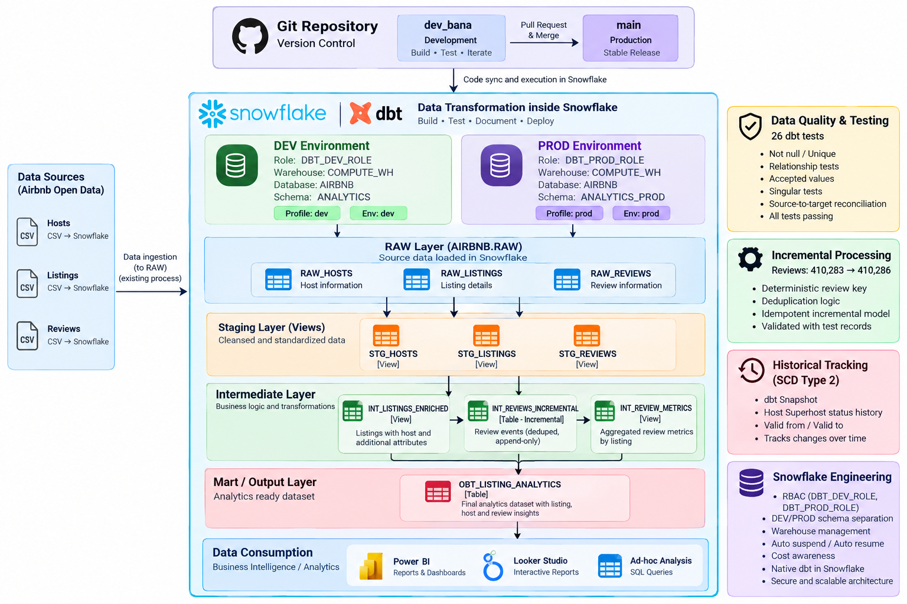

# Airbnb Analytics Engineering Pipeline

### Snowflake + dbt | Incremental Processing | SCD Type 2 | Data Quality | DEV/PROD Deployment

This project implements a production-style **analytics engineering pipeline for Airbnb data using Snowflake and dbt**.

Raw host, listing and review data is transformed through structured **staging, intermediate and analytics layers** into a tested, analytics-ready **One Big Table (OBT)**.

The project demonstrates not only SQL transformation, but also:

- **Incremental processing**
- **Data-quality validation**
- **Historical tracking using SCD Type 2**
- **DEV/PROD environment separation**
- **Role-Based Access Control (RBAC)**
- **Git-based development and deployment**
- **Snowflake warehouse and cost awareness**

The objective was to build a **practical and explainable data engineering solution** rather than add technologies or architectural complexity that the dataset did not require.

---

## Architecture



The pipeline follows:

**Raw Sources → Staging → Intermediate → Analytics OBT → BI / Analytics**

Development and production are separated through dedicated **Snowflake schemas, dbt targets and roles**.

---

## Business Objective

The source data contains information about:

- Airbnb hosts
- Property listings
- Guest reviews
- Review sentiment

The engineering objective was to create a reliable analytical dataset capable of supporting analysis of:

- Listing characteristics and pricing
- Minimum-stay behaviour
- Host and Superhost attributes
- Review activity
- Positive, neutral and negative sentiment
- Listings with and without reviews
- Historical changes to host attributes

The final analytical model maintains **one row per listing** while incorporating aggregated host and review information.

---

## Technology Stack

| Technology | Purpose |
|---|---|
| **Snowflake** | Cloud data warehouse and compute |
| **dbt** | Transformation, testing, documentation and deployment |
| **SQL** | Data transformation and analytical modelling |
| **Jinja** | Reusable transformation logic |
| **Git** | Version control and DEV → PROD workflow |
| **Power BI / Looker Studio** | Potential downstream analytics consumption |

The dbt project was developed using **Snowflake's native dbt development environment**.

---

# Data Architecture

## 1. RAW Layer

Source data is stored in:

`AIRBNB.RAW`

The three source tables are:

```text
RAW_HOSTS
RAW_LISTINGS
RAW_REVIEWS
```

These tables preserve source data and act as the controlled input to the dbt transformation pipeline.

dbt `source()` declarations are used instead of directly referencing physical source tables throughout downstream models.

---

## 2. Staging Layer

The staging layer standardizes and cleans source data.

```text
STG_HOSTS
STG_LISTINGS
STG_REVIEWS
```

These models are implemented as **views**.

Typical transformations include:

- Column renaming
- Data-type conversion
- Price conversion from text to numeric
- Standardization of review fields
- Data-quality correction

For example, listings containing:

```text
minimum_nights = 0
```

are transformed to:

```text
minimum_nights = 1
```

because a zero-night minimum stay is not analytically meaningful.

Very high minimum-night values are deliberately retained because they may represent long-term rental arrangements rather than erroneous data.

---

## 3. Intermediate Layer

The intermediate layer contains reusable business transformations.

### `INT_LISTINGS_ENRICHED`

Combines listing and host attributes while preserving the **one-row-per-listing grain**.

### `INT_REVIEWS_INCREMENTAL`

Stores deduplicated review events using dbt incremental materialization.

**Materialization:** `TABLE - INCREMENTAL`

### `INT_REVIEW_METRICS`

Aggregates review events to listing level and calculates:

- Total reviews
- First review date
- Last review date
- Positive reviews
- Neutral reviews
- Negative reviews
- Unclassified reviews
- Sentiment percentages

Sentiment percentages use only **classified reviews** as their denominator so that null sentiment values do not distort the distribution.

---

# Incremental Processing

Review data was selected for incremental processing because it represents the largest and naturally growing event dataset in the project.

A deterministic review key is generated from:

```text
listing_id
review_date
reviewer_name
review_comments
```

The resulting key is hashed and used as the dbt model's `unique_key`.

The model uses:

```text
materialized = incremental
incremental_strategy = merge
```

together with dbt `is_incremental()` logic.

### Duplicate Investigation

The raw review dataset originally contained:

**410,284 physical rows**

Initial grain analysis showed that:

```text
listing_id + review_date + reviewer_name
```

was not sufficient to uniquely identify reviews because the same reviewer could have distinct comments for the same listing on the same date.

Adding review comments produced:

**410,283 unique logical reviews**

Investigation of the remaining collision identified **one genuine duplicate record**.

The incremental layer therefore intentionally deduplicates the raw dataset to:

**410,283 logical review events**

### Incremental Validation

Three controlled review records were subsequently added to the RAW source.

The pipeline increased from:

**410,283 → 410,286 reviews**

without rebuilding the existing logical dataset.

This demonstrates:

- Incremental loading
- Deterministic keys
- Deduplication
- Merge-based processing
- Idempotent pipeline behaviour

---

# Historical Tracking — SCD Type 2

The project demonstrates historical dimension tracking using a **dbt Snapshot**.

Host data is tracked using the timestamp strategy:

```text
unique_key = ID
strategy = timestamp
updated_at = UPDATED_AT
```

A controlled change was made to a host's Superhost status.

Before the change:

```text
Snapshot rows: 14,111
```

After the host attribute changed and the snapshot was rerun:

```text
Snapshot rows: 14,112
```

The previous version was automatically closed using:

`DBT_VALID_TO`

while the new version became the current record with:

`DBT_VALID_TO = NULL`

This demonstrates **Slowly Changing Dimension Type 2 (SCD2)** behaviour and preservation of historical state.

---

# Final Analytics Model

The serving layer contains:

`OBT_LISTING_ANALYTICS`

**Materialization:** `TABLE`

The OBT combines listing, host and review information into a consumption-ready analytical dataset.

### Listing Attributes

- Listing ID
- Listing name
- Listing URL
- Room type
- Price
- Minimum nights
- Stay category

### Host Attributes

- Host ID
- Host name
- Superhost status
- Host creation date

### Review Analytics

- Total reviews
- First review date
- Last review date
- Positive reviews
- Neutral reviews
- Negative reviews
- Unclassified reviews
- Sentiment percentages
- Review availability indicator

---

## Final Dataset Validation

The final analytics dataset contains:

### **17,499 listings**

The model deliberately preserves both reviewed and unreviewed properties through a **LEFT JOIN** rather than unintentionally removing listings during review aggregation.

Initial validation showed:

| Metric | Count |
|---|---:|
| Listings with reviews | 14,245 |
| Listings without reviews | 3,254 |
| **Total listings** | **17,499** |

Following incremental validation, the review-event layer contains:

### **410,286 logical reviews**

---

# Reusable Jinja Logic

A custom dbt macro categorizes listings according to minimum-stay requirements.

The resulting categories are:

```text
short_stay
medium_stay
long_stay
extended_stay
```

This keeps business logic **centralized and reusable** rather than repeating CASE expressions across downstream models.

---

# Data Quality & Testing

The project includes **26 dbt data tests** covering multiple forms of validation.

Testing includes:

- `not_null`
- `unique`
- Relationship / referential-integrity tests
- Accepted-value validation
- Singular SQL tests
- Business-rule validation
- Source-to-target reconciliation
- Sentiment-percentage validation

Examples include ensuring that:

```text
minimum_nights >= 1
```

and validating:

```text
total_reviews =
    positive_reviews
  + neutral_reviews
  + negative_reviews
  + unclassified_reviews
```

Relationships are also validated between:

```text
Listings → Hosts
Reviews  → Listings
```

The final build passes the project's complete test suite.

---

# DEV → PROD Deployment

The project uses separate development and production environments.

## Development

```text
Role:       DBT_DEV_ROLE
Database:   AIRBNB
Schema:     ANALYTICS
Warehouse:  COMPUTE_WH
```

## Production

```text
Role:       DBT_PROD_ROLE
Database:   AIRBNB
Schema:     ANALYTICS_PROD
Warehouse:  COMPUTE_WH
```

Both environments read from the controlled:

`AIRBNB.RAW`

source layer.

The default dbt target remains **DEV** to reduce the possibility of accidental production writes.

Production deployment was independently validated, with the production OBT reconciling to:

- **17,499 listings**
- **410,286 logical reviews**

---

# Snowflake RBAC

Dedicated roles were created for dbt rather than performing pipeline execution using `ACCOUNTADMIN`.

```text
DBT_DEV_ROLE
DBT_PROD_ROLE
```

Permissions are scoped to the resources required by each environment.

This includes controlled access to:

- Warehouse
- Database
- RAW sources
- Development schema
- Production schema
- Required table/view creation and management

The pipeline was successfully rebuilt using the dedicated dbt roles, demonstrating a **least-privilege-oriented execution model**.

---

# Materialization Strategy

Materializations were selected according to workload rather than applying one strategy everywhere.

| Layer | Materialization | Reason |
|---|---|---|
| Staging | View | Lightweight cleaning and standardization |
| Intermediate | Mostly View | Reusable transformations without unnecessary storage |
| Review Events | Incremental Table | Growing event dataset |
| Analytics OBT | Table | Fast downstream analytical consumption |
| Host History | Snapshot | SCD Type 2 historical tracking |

This keeps the architecture simple while avoiding unnecessary recomputation where persistence provides value.

---

# Why an OBT?

The final serving model uses an **analytics-oriented One Big Table (OBT)** rather than implementing a dimensional model purely for architectural convention.

The dataset is relatively compact and primarily supports listing-level analysis.

The OBT therefore provides:

- Simple BI consumption
- Fewer downstream joins
- Precomputed review metrics
- Straightforward semantic interpretation
- Efficient access to commonly required analytical attributes

A star schema could be introduced if analytical requirements, dataset scale or downstream use cases justified the additional modelling complexity.

---

# Snowflake Performance & Cost Awareness

The project uses an **X-Small Snowflake warehouse**, appropriate for the workload.

Warehouse configuration uses:

```text
AUTO_SUSPEND
AUTO_RESUME
```

to avoid paying for idle compute.

The modelling strategy also intentionally avoids persisting every transformation.

Staging and most intermediate models remain views, while persistence is used where it provides a clear benefit:

```text
Incremental review events → TABLE
Analytics serving model   → TABLE
```

Snowflake Query History and Query Profile can be used to examine execution behaviour and warehouse usage.

---

# Intentional Architecture Boundaries

The project deliberately avoids adding technologies solely to increase apparent architectural complexity.

Features such as:

- Snowflake Streams
- Snowflake Tasks
- Dynamic Tables
- Snowpipe
- Clustering keys
- External orchestration

were not required for the scope and scale of this dataset.

The objective was to demonstrate **sound engineering decisions rather than maximum feature count**.

---

# Project Structure

```text
AIRBNB_DBT_DEV/
│
├── README.md
├── images/
│   └── airbnb_snowflake_dbt_architecture.png
│
└── snowflake_dbt/
    │
    ├── models/
    │   ├── staging/
    │   │   ├── stg_hosts.sql
    │   │   ├── stg_listings.sql
    │   │   ├── stg_reviews.sql
    │   │   └── staging.yml
    │   │
    │   ├── intermediate/
    │   │   ├── int_listings_enriched.sql
    │   │   ├── int_reviews_incremental.sql
    │   │   ├── int_review_metrics.sql
    │   │   └── _intermediate.yml
    │   │
    │   └── marts/
    │       ├── obt_listing_analytics.sql
    │       └── _marts.yml
    │
    ├── macros/
    │   └── get_stay_category.sql
    │
    ├── tests/
    │   ├── assert_minimum_nights_positive.sql
    │   ├── assert_review_metrics_reconcile.sql
    │   └── assert_sentiment_percentage_valid.sql
    │
    ├── snapshots/
    │   └── hosts_snapshot.sql
    │
    ├── sources.yml
    ├── dbt_project.yml
    ├── profiles.yml
    └── env.yml
```

---

# Git Workflow

Development follows a branch-based workflow:

```text
dev_bana
    ↓
Develop
    ↓
Build & Test
    ↓
Validate
    ↓
Commit / Push
    ↓
Merge
    ↓
main
    ↓
Production Deployment
```

This keeps development changes separate from the stable production codebase.

---

# dbt Documentation & Lineage

dbt documentation was generated successfully for the project.

The generated project metadata includes:

```text
7 models
26 data tests
1 snapshot
3 sources
475 macros
```

dbt lineage provides traceability across the transformation flow:

```text
RAW Sources
     ↓
Staging
     ↓
Intermediate
     ↓
Analytics OBT
```

This makes upstream and downstream model dependencies visible and auditable.

---

# Key Engineering Decisions

This project demonstrates practical decision-making across the engineering lifecycle.

### Data Modelling
Model grain is explicitly defined and protected throughout the transformation pipeline.

### Data Quality
Source anomalies are investigated before transformation decisions are made rather than blindly deleting unusual records.

### Incremental Processing
The event-level review dataset is incrementally processed rather than incorrectly applying incremental logic directly to an aggregate model.

### Deduplication
A defensible logical review key was derived by analysing actual source-data behaviour.

### Historical Tracking
SCD Type 2 was introduced specifically where historical state provides analytical value.

### Materialization
Views, tables and incremental models are selected according to workload and consumption requirements.

### Security
Pipeline execution was moved away from administrative roles to dedicated dbt roles.

### Deployment
Development and production execution are separated through schemas, targets and RBAC.

### Cost Awareness
Compute is appropriately sized and configured to avoid unnecessary warehouse runtime.

---

# Skills Demonstrated

**Snowflake Data Engineering** • **dbt** • **SQL** • **Jinja** • **Analytics Engineering** • **Data Modelling** • **Data Quality Testing** • **Incremental Pipelines** • **Deduplication** • **SCD Type 2** • **RBAC** • **DEV/PROD Deployment** • **Git** • **Warehouse & Cost Management**

---

# Portfolio Evidence

Supporting evidence for the project includes:

1. **Architecture diagram**
2. **dbt lineage / DAG**
3. **Successful dbt build and 26-test execution**
4. **Incremental processing validation**
5. **SCD Type 2 historical record validation**
6. **DEV and PROD environment separation**
7. **Final `OBT_LISTING_ANALYTICS` output**

---

# Project Outcome

The project converts raw Airbnb operational data into a **tested, documented and deployment-ready analytical data layer in Snowflake**.

Rather than focusing only on SQL transformations, it demonstrates the broader engineering lifecycle:

> **Source Management → Modelling → Data Quality → Incremental Processing → Historical Tracking → Security → Environment Separation → Deployment → Analytical Consumption**

The result is a deliberately compact but production-oriented **Snowflake + dbt analytics engineering implementation**.